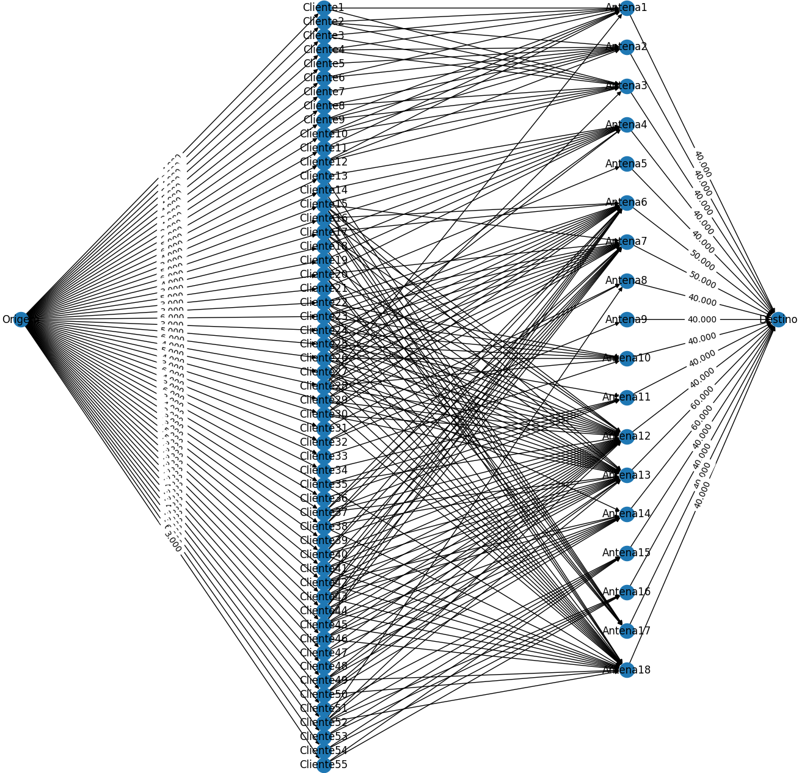
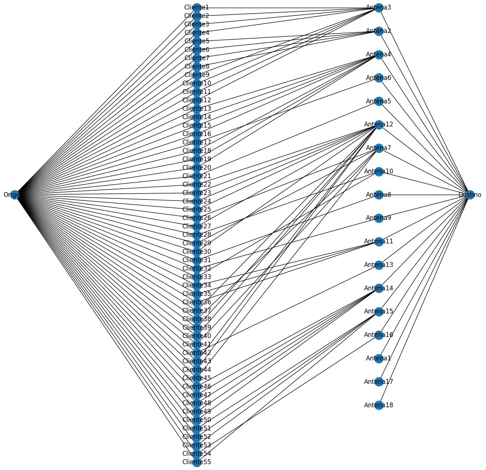

<h1 align="center" font-size="200em"><b>Otimização da Atribuição de Clientes em Redes de Internet via Rádio na Zona Rural: Uma Abordagem Eficiente com Teoria dos Grafos e Fluxo Máximo</b></h1>

<!-- imagem -->

## 📌Trabalho Acadêmico

Este projeto acadêmico foi apresentado durante a disciplina de Algoritmos e Estruturas de Dados II, com o propósito de explorar a aplicabilidade da teoria dos grafos na resolução de problemas abrangentes em diversas áreas e disciplinas. Cada aluno foi desafiado a identificar um problema específico suscetível de modelagem por meio de um grafo, propondo e aplicando algoritmos adequados para abordar uma questão de pesquisa relacionada ao problema escolhido.

O tema selecionado para este projeto foi a "Otimização da Atribuição de Clientes em Redes de Internet via Rádio na Zona Rural: Uma Abordagem Eficiente com Teoria dos Grafos e Fluxo Máximo". Optou-se pela linguagem de programação Python devido às suas excelentes bibliotecas que facilitam a manipulação de grafos e a aplicação do algoritmo de fluxo máximo. 
 
Este trabalho visa identificar e estabelecer conexões eficientes entre clientes e antenas, determinando a antena à qual cada cliente deve se conectar para obter o maior fluxo de internet via rádio possível. Adicionalmente, o projeto permite a obtenção de informações como gargalos e mau uso de antenas. Para alcançar esse objetivo, é necessário coletar dados, tais como todas as conexões possíveis entre clientes e antenas, o sinal dessas conexões, os planos de internet de cada cliente e a capacidade de cada antena.

## 🖥️ Exemplos de Funcionamento do Código, com Imagens de Grafos:

#### ➡️Grafo com Todas as Conexões Possíveis entre Cliente e Antena:

  

#### ➡️Grafo Após a Aplicação do Algoritmo de Fluxo Máximo, com as Melhores Conexões Possíveis para Cada Cliente:

  

## 👾Compilação e Execução

### Dados:

- Para incluir os dados destinados à otimização, simplesmente coloque-os dentro da pasta "data" e ajuste os nomes no código, conforme indicado nos comentários das linhas 20, 21, 22 e 23 do código.

### Execução Local:

- O projeto é implementado em Python nas versão 3.12.0, portanto, é necessário ter esse Python instalado no sistema operacional;
- Pode ser executado em diferentes sistemas operacionais, incluindo Linux e Windows;
- Instale as bibliotecas informadas nas linhas 4,5 e 6 do código usando o seguinte comando no terminal ou prompt de comando: pip install biblioteca. Substitua "biblioteca" pelo nome da biblioteca em questão;
- Navegue até o diretório do projeto no terminal ou prompt de comando;
- Execute o projeto com o seguinte comando: python maximumFlow.py;
- Utilizando o código com os dados disponibilizados do trabalho, será gerado três imagens com os grafos resultantes. Cada um deles inclui as mesmas conexoes origem→cliente e antena→destino, uma vez que se referem aos mesmos dados. No entanto, cada grafo possui configuraçoes distintas nas conexões cliente→antena: a Figura 1 mostra todas as conexoes efetivas nas quais os clientes foram associados de forma manual, a Figura 2 abrange todas as possibilidades de conexão, e a Figura 3 representa o grafo resultante após a aplicação do algoritmo de fluxo máximo. Após a geração de cada imagem, é necessário fechá-la (é possível salvar a imagem antes de fechar), e as próximas serão geradas até a conclusão da execução do código.

### Execução no Google Colab:

- O projeto também pode ser executado no ambiente do Google Colab. Para isso, você pode importar o projeto diretamente para o Colab ou fazer upload dos arquivos necessários.

### Arquivo Resultante:

- Um arquivo, que engloba todas as conexões entre clientes e antenas com o maior fluxo, será gerado na pasta "data".

## ✉️Contato

  
 Mariana Rodrigues Lamounier Melo

 <a href="https://t.me/MariRodriguess0">
  
 

<a style="color:black" href="mailto:mariana.itapec@gmail.com?subject=[GitHub]%20Source%20Dynamic%20Lists">
✉️ <i>mariana.itapec@gmail.com</i>
</a>
